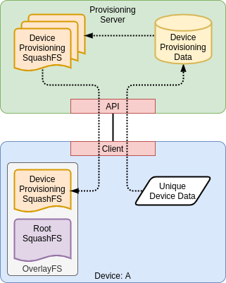

Device Provisioning
===================

Each device needs to be configured with some data which is specific to the
device. Part of provisioning process is getting this data generated and
installed on the device.

Provisioning Methodology
------------------------

Since the devices use read-only squashfs root filesystems, it seems that it
would be convenient to install the provisioning data into the rootfs image, but
that would mean generating a unique rootfs image for each device which is
problematic.

A more managable method is to use a provisioning service to:

* Generate the device specific provisioning data.
* Package all of the data into a squashfs image.
* Sign the squashfs image.
* Provide an API for the device to fetch the squashfs image.

When a device is being provisioned, it can:

* Fetch a provisioning data image from the provisioning service.
* Verify the image against the signature.
* Read-only mount the provisioning data squash image into the rootfs using
  overlayfs.

A device can be reprovisioned at any time by having it fetch a new provisioning
image from the provisioning service.

The provisioning service could store the images such that a device can request
the image again if needed. Some ofthe provisioning data could be static for a
device, while other data could need to be updated over time. The provisioning
service provide the device with an updated provisioning data images in this way.

The provisioning service could also use MQTT (or any event messaging service)
to send a message to the device indicating that the device needs to update
its provisioning data.

Security Consideratons
----------------------

Initial Device Provisioning
+++++++++++++++++++++++++++

* The provisioning data must be validated before it is installed by the device.
* The initial provisioning of devices needs to be performed on a secure network.
* How to have the provisioning service trust the device and vice versa if the
  device does not yet have any trusted (and secure) data on it? This seems to
  imply that the initial provisioning can not be done outside of a secure and
  private network. Might be able to have trusted proxy service that device
  connects to first and the proxy securely accesses the API on the devices behalf.

Provisioning Updates of Devices in the Field
++++++++++++++++++++++++++++++++++++++++++++

* The provisioning data must be validated before it is installed by the device.
* The provisioning service API needs to be secured with mTLS.
* Devices must authenticate to the provisioning service to be able to fetch a
  provisioning image.

Provisioning Data Image Contents
--------------------------------

The following files MUST exist at the specified absolute paths in the
provisioning squashfs image:

+--------------------------+------------+------------------------------------+
| Data File                | Type       | Notes                              |
+==========================+============+====================================+
| ``/etc/hostname``        | Immutable  |                                    |
+--------------------------+------------+------------------------------------+
| ``/etc/machine-id``      | Immutable  | Might not need to be in the image. |
|                          |            | Can be generated on the device.    |
+--------------------------+------------+------------------------------------+
| ``/etc/serial-number``   | Immutable  | Should be derived from HW SerNum.  |
+--------------------------+------------+------------------------------------+
| ``/etc/mqtt-client-id``  | Immutable  |                                    |
+--------------------------+------------+------------------------------------+
| ``/etc/mqtt-group-id``   | Immutable  |                                    |
+--------------------------+------------+------------------------------------+

Data File Types:

Immutable

    Immutable data can never be changed for a device and MUST not change when
    the device requests a new or updated provisioning image.

Mutable

    Mutable data can be changed for a device by updating the provisioning
    image.

Misc Notes
----------

Machine IDs
+++++++++++

The ``machine-id`` is added as an empty file when the image is built with
bitbake. At boot time, systemd will generate a ``/etc/machine-id`` file in a
``tmpfs`` and mount that over ``/etc/machine-id`` in the root squashfs when
using a read-only rootfs. Each time you boot, you get a different
``machine-id``.

The provisioning image can provide a ``machine-id`` that is persistent across
reboots. May be able to generate this at boot time from information in the
provisioning data instead of including it in the provisioning data (since it
should be considered confidential).

See ``man machine-id`` for more details.

Serial Numbers
++++++++++++++

Serial numbers need to be unique to the device. Some devices have unique
hardware ID that can be used to generate a serial number.

+------------------+-------------------------------------------------+
|   Device Board   |                   Hardware ID                   |
+==================+=================================================+
| RaspberryPi 4    | ``grep '^Serial' /proc/cpuinfo`` or read        |
|                  | ``/sys/firmware/devicetree/base/serial-number`` |
+------------------+-------------------------------------------------+
| BeagleBone Black | ``grep '^Serial' /proc/cpuinfo`` or read        |
|                  | ``/sys/firmware/devicetree/base/serial-number`` |
+------------------+-------------------------------------------------+
| BeagleBone AI    | ``grep '^Serial' /proc/cpuinfo`` or read        |
|                  | ``/sys/firmware/devicetree/base/serial-number`` |
+------------------+-------------------------------------------------+

These hardware IDs can be used to generate a unique serial number in a
consistent format that can be provided to the provisioning service to uniquely
and reproducibly identify the device. This allows for the device to potentially
get the same provisioning data image (or an updated image) from the
provisioning service each time it is booted (even if the SD card has been
reflashed with a new image, which is common during development cycles).

Since the format of the HWID varies from one device type to another type, the
HWID will be sent to the provisioning service. The service will convert it into
a device type independent, common format (a hex value with 10 hex-digits, e.g.
1a2b3c4d5e) which will be used to generate names and values that need
to be device specific (e.g. hostname).

Given the same serial number, two instances of the provisioning service should
produce virtually the same provisioning data image.

**NOTE:** On RaspberryPi devices, the HWID (aka. serial number) is passed to
the kernel from ``u-boot`` via an addition to the devicetree and ``u-boot``
dumps its environment to ``/boot/uBoot.env``. This causes the HWID (serial
number) to persist in the ``uBoot.env`` file on the SD card. Moving the SD card
to another device carries over the serial number from the previously device
which booted from that SD card. There are three ways to deal with this:

1) Don't move SD cards to other devices.
2) Reflash an image to the SD card before using it in a new device.
3) Delete the ``/boot/uBoot.env`` from the SD card before using it in a new
   device (although this is undesirable if the provisioning image is for the
   old device and serial-number).
